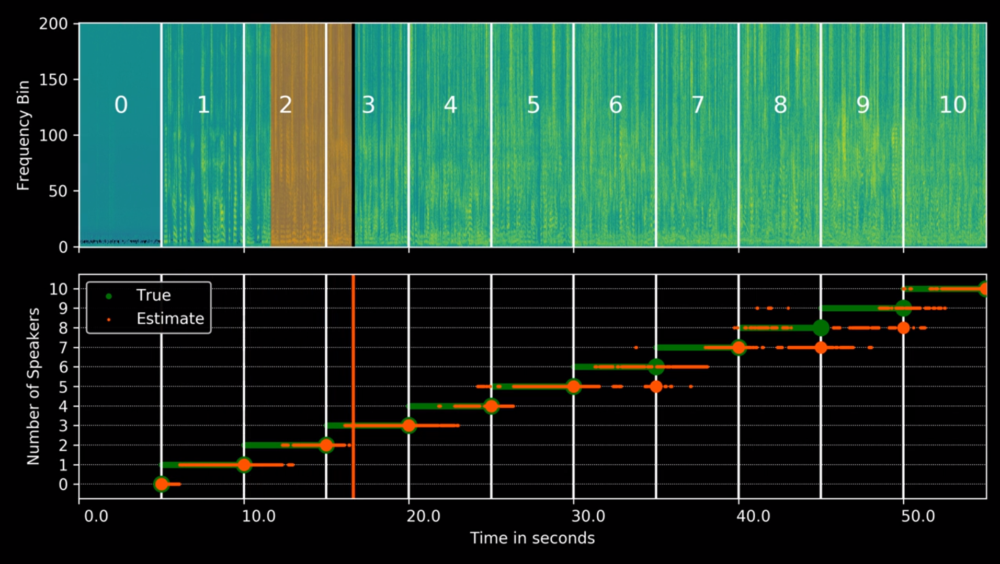

# Concurrent Speakers Counter
Estimate the number of concurrent speakers from single channel mixtures to crack the "cocktail-party” problem. The project is based on a Bidirectional Long Short-Term Memory (BLSTM) Recurrent Neural Network (RNN) which takes into account a past and future temporal context. 

## Model Summary

## Reference Paper & Code
As we all know, it is pretty hard to solve the cocktail-party problem. This is ***the first study on data-driven speaker count estimation*** and the first step to crack the problem. Thanks for the author's paper and code and it helps me a lot.
* __Accepted__: ICASSP2018, Apr 15, 2018 – Apr 20, 2018 in Calgary, Canada
* __Title__: Classification vs. Regression in Supervised Learning for Single Channel
 Speaker Count Estimation
* __Authors__: Fabian-Robert Stöter, Soumitro Chakrabarty, Bernd Edler, Emanuël
 A. P. Habets
* __Code__: [CountNet](https://github.com/faroit/CountNet)
